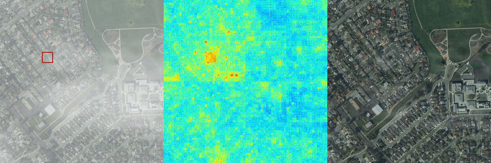

# 🌐 Tokenize Image Patches: Global Context Fusion for Effective Haze Removal in Large Images (CVPR 2025)


Project Page: [DehazeXL](https://castlechen339.github.io/DehazeXL.github.io/)

Paper Link: [CVPR2025 OpenAccess]( https://openaccess.thecvf.com/content/CVPR2025/html/Chen_Tokenize_Image_Patches_Global_Context_Fusion_for_Effective_Haze_Removal_CVPR_2025_paper.html)

Arxiv: https://arxiv.org/abs/2504.09621


This repository is an official implementation of the paper "*Tokenize Image Patches: Global Context Fusion for Effective Haze Removal in Large Images*". Our main contribution is the proposal of DehazeXL,  an end-to-end haze removal framework designed for large-sized images.


## 📦 Installation

To install the necessary dependencies for ***DehazeXL***, please follow the steps below:

```
# Clone using the web URL
git clone https://github.com/CastleChen339/DehazeXL.git

# Create conda env
conda create -n DehazeXL python=3.10
conda activate DehazeXL

# Install Pytorch
pip install torch torchvision torchaudio --index-url https://download.pytorch.org/whl/cu124

# Install other packages needed
pip install -r requirements.txt
```

> Please ensure that you have the correct version of PyTorch installed that matches your device’s CUDA version. You can check your CUDA version and find the corresponding PyTorch build using the [PyTorch installation guide](https://pytorch.org/get-started/locally/).


## 📚 Dataset

We have developed an ultra-high-resolution haze removal dataset named ***8KDehaze***. The dataset is available in two versions for flexibility in usage:

- **Mini Version**: Approximately 11GB in size, containing 100 sample images.
- **Full Version**: A comprehensive dataset spanning 931GB, with a total of 12,000 sample images.

Both the mini and full datasets share the same directory structure, which is organized as follows:

```
8KDehaze/
├── clear/               # Clear images without haze
│   ├── image1.png
│   ├── image2.png
│   └── ...
├── cloud_L1/            # Light haze
│   ├── image1.png
│   ├── image2.png
│   └── ...
├── cloud_L2/            # Moderate haze
│   ├── image1.png
│   ├── image2.png
│   └── ...
├── cloud_L3/            # Dense haze
│   ├── image1.png
│   ├── image2.png
│   └── ...
└── cloud_L4/            # Very Dense haze
    ├── image1.png
    ├── image2.png
    └── ...
```


You can obtain the `8KDehaze` dataset from the following sources:

- **Mini Version (Recommended!!! Enough to train a model)**: [Modelscope](https://www.modelscope.cn/datasets/fengyanzi/8kdehaze_mini/) [Hugging Face](https://huggingface.co/datasets/fengyanzi/8KDehaze_mini)  [BaiduCloud](https://pan.baidu.com/s/1ZVipOYnTR-M_xG5FZNtZPQ?pwd=4321)  [AliCloud](https://www.alipan.com/s/7AVat72s4Sk)
- **Full Version (Very Large!!!)**: [Baidu Pan](https://pan.baidu.com/s/1-z7h-BLV7BxNg4Qp6Hi5uQ?pwd=4321) [Hugging Face (Recommended)](https://huggingface.co/datasets/CastleChen339/8KDehaze/tree/main)

> To load the dataset, please refer to the `dataset.py`. Ensure that you adjust the file paths and parameters according to the version of the dataset you are using.


## 🚀 Usage

### How to train


To train DehazeXL model using our provided `train.py` script, you will need to set up the appropriate command-line arguments. The following arguments can be passed to the `train.py` script:

- `--data_dir`: The path to the directory where your dataset is located. Default is `./datasets/8KDehaze`.
- `--save_dir`: The directory where checkpoints will be saved. Default is `./checkpoints/train`.
- `--save_cycle`: The frequency at which checkpoints are saved, in epochs. Default is `1`, indicating that the program will save checkpoints after each epoch.
- `--resume`: The path to a checkpoint file to resume training from. If not specified, training starts from scratch. Default is None.
- `--lr`: The learning rate for the optimizer. Default is 0.0001.
- `--batch_size`: The number of images per batch. Default is 2.
- `--no-cuda`: If specified, training will be performed on CPU only, even if a GPU is available. Default is False.
- `--epochs`: The number of epochs to train for. Default is 40.
- `--nor`: If specified, the images will be normalized. Default is False.

Here's an example of how to run the training script with custom arguments:

```
python train.py --data_dir ./datasets/8KDehaze --save_dir ./my_checkpoints --save_cycle 5 --lr 0.0002 --batch_size 4 --epochs 10 --nor
```

This command will train the model using the dataset located at `./datasets/8KDehaze`, save checkpoints every 5 epochs to `./my_checkpoints`, use a learning rate of `0.0002`, a batch size of `4`, train for `10` epochs, and normalize the images.

> [!NOTE]
>
> Ensure that the dataset is properly downloaded and organized as described in the Dataset section before starting training. Adjust the `--batch_size` according to the memory capacity of your GPU. If you encounter out-of-memory errors, try reducing the batch size.

### How to test

To test the trained model using our provided `test.py` script, you will need to set up the appropriate command-line arguments. The following arguments can be used with the `test.py` script:

- `--test_img`: The path to the image you want to test.
- `--model_path`: The path to the pretrained model checkpoint file.
- `--save_dir`: The directory where the predicted results will be saved. Default is `./res`.
- `--no-cuda`: A flag to disable CUDA. Use this if you do not have a CUDA-compatible GPU or for debugging purposes. Default is False.
- `--uni_size_w`: The unified width size for input images. Default is `8192`.
- `--uni_size_h`: The unified height size for input images. Default is `8192`.
- `--nor`: A flag to normalize the input image. Use this if your model expects normalized input.
- `--fp16`: A flag to load models and data in FP16 format for potentially faster inference on compatible hardware. Default is False.

Here's an example of how to run the test script with custom arguments:

```
python test.py --test_img ./datasets/your_test_image.png --model_path ./checkpoints/your_model.pth --save_dir ./your_results_directory
```

> [!NOTE]
>
> The `--uni_size_w` and `--uni_size_h` arguments are important if your model requires a specific input size. If your images are not the default size, you will need to adjust these parameters.
> The `--fp16` flag is optional but can speed up inference if your hardware supports half-precision floating-point calculations.


## 🏞️ Visualization


## 🌈 Dehazing Attribution Map (DAM)

DAM is a visual attribution method tailored for haze removal tasks. It helps to evaluate the efficiency of global context utilization in haze removal performance. For the implementation of DAM, please visit [Dehazing Attribution Map](https://github.com/fengyanzi/DehazingAttributionMap).



## 📖 Citation

If you find our code useful, please consider citing our paper:

```
@InProceedings{Chen_2025_CVPR,
    author    = {Chen, Jiuchen and Yan, Xinyu and Xu, Qizhi and Li, Kaiqi},
    title     = {Tokenize Image Patches: Global Context Fusion for Effective Haze Removal in Large Images},
    booktitle = {Proceedings of the Computer Vision and Pattern Recognition Conference (CVPR)},
    month     = {June},
    year      = {2025},
    pages     = {2258-2268}
}
```


## 📞 Contact

For any questions or suggestions, please feel free to contact us at castlechen@bit.edu.cn or Chji339@163.com.


## 😊 Acknowledgement

We would like to thank the authors of [bair-climate-initiative/xT](https://github.com/bair-climate-initiative/xT) for their inspiring work, which has been a valuable reference for our research.
